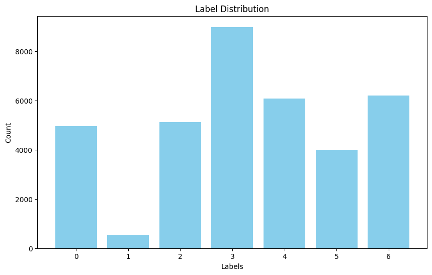
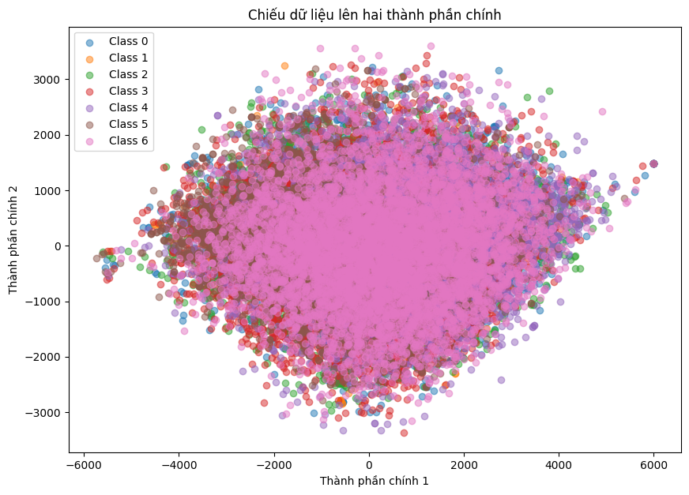
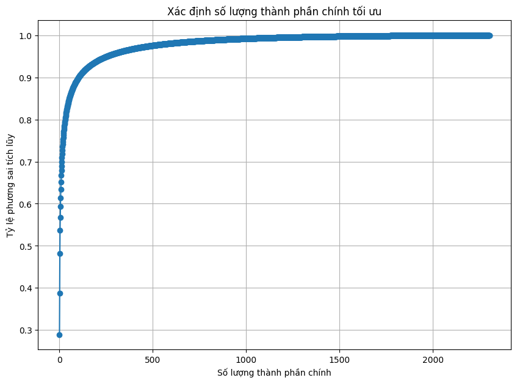

# Mini-Project for Fundamentals of Machine Learning Course

This repository contains the code and data for a mini-project on facial expression recognition using machine learning algorithms.

## 📑 Project Policy
- Team: group should consist of 3-4 students.

    |No.| Student Name    | Student ID |
    | --------| -------- | ------- |
    |1|Đỗ Thành Nguyên|21110349|
    |2|Chu Nguyễn Gia Khánh|21110319|
    |3|||
    |4|||

- The submission deadline is strict: **11:59 PM** on **June 22nd, 2024**. Commits pushed after this deadline will not be considered.

## 📦 Project Structure

The repository is organized into the following directories:

- **/data**: This directory contains the facial expression dataset. You'll need to download the dataset and place it here before running the notebooks. (Download link provided below)
- **/notebooks**: This directory contains the Jupyter notebook ```EDA.ipynb```. This notebook guides you through exploratory data analysis (EDA) and classification tasks.

## ⚙️ Usage

This project is designed to be completed in the following steps:

1. **Fork the Project**: Click on the ```Fork``` button on the top right corner of this repository, this will create a copy of the repository in your own GitHub account. Complete the table at the top by entering your team member names.

2. **Download the Dataset**: Download the facial expression dataset from the following [link](https://mega.nz/file/foM2wDaa#GPGyspdUB2WV-fATL-ZvYj3i4FqgbVKyct413gxg3rE) and place it in the **/data** directory:

3. **Complete the Tasks**: Open the ```notebooks/EDA.ipynb``` notebook in your Jupyter Notebook environment. The notebook is designed to guide you through various tasks, including:
    
    1. Prerequisite
    
    
   
    - The data is imbalanced.

    2. Principle Component Analysis
    
    

    - Visualize the data projected onto two principal components.

   

   
    - Determine the optimal number of principal components using pca.explained_variance_ratio_(95%).
   
    4. Image Classification
    
	- Image classification on PCA data and resized data.

Model Training:
- Logistic Regression
- SVM
- Random Forest
- MLP

	5. Evaluating Classification Performance
#### Logistic Regression:
- PCA Data:
  ```
  Precision: 0.37, Recall: 0.38, F1-score: 0.35, Accuracy: 0.38
  ```
- Resized Data:
  ```
  Precision: 0.36, Recall: 0.38, F1-score: 0.36, Accuracy: 0.38
  ```

#### SVM:
- PCA Data:
  ```
  Precision: 0.47, Recall: 0.48, F1-score: 0.47, Accuracy: 0.48
  ```
- Resized Data:
  ```
  Precision: 0.46, Recall: 0.46, F1-score: 0.44, Accuracy: 0.46
  ```

#### Random Forest:
- PCA Data:
  ```
  Precision: 0.48, Recall: 0.39, F1-score: 0.34, Accuracy: 0.39
  ```
- Resized Data:
  ```
  Precision: 0.48, Recall: 0.46, F1-score: 0.43, Accuracy: 0.46
  ```

#### MLP:
- PCA Data:
  ```
  Precision: 0.35, Recall: 0.35, F1-score: 0.34, Accuracy: 0.35
  ```
- Resized Data:
  ```
  Precision: 0.23, Recall: 0.24, F1-score: 0.22, Accuracy: 0.24
  ``` 

    Make sure to run all the code cells in the ```EDA.ipynb``` notebook and ensure they produce output before committing and pushing your changes.

5. **Commit and Push Your Changes**: Once you've completed the tasks outlined in the notebook, commit your changes to your local repository and push them to your forked repository on GitHub.


Feel free to modify and extend the notebook to explore further aspects of the data and experiment with different algorithms. Good luck.
